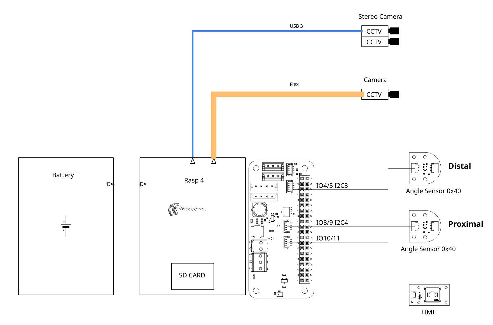
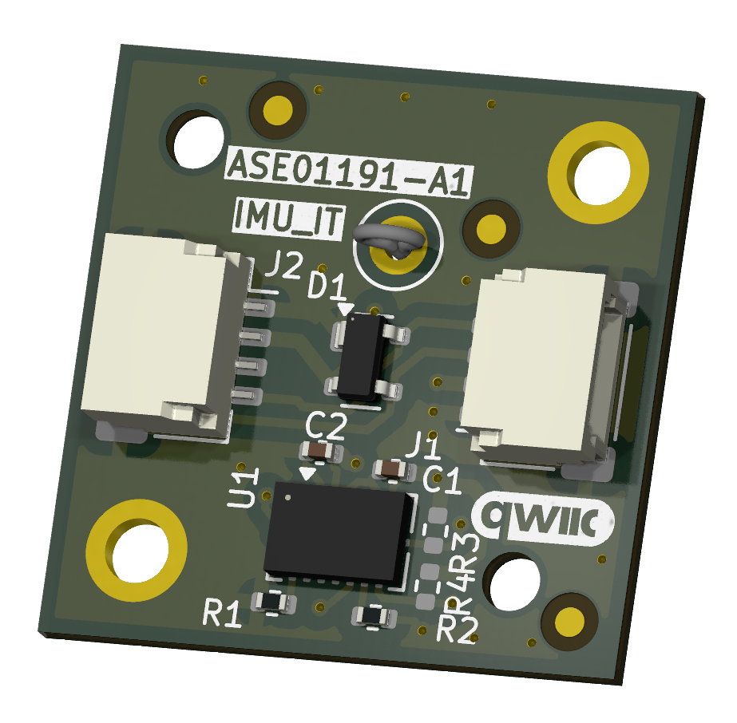
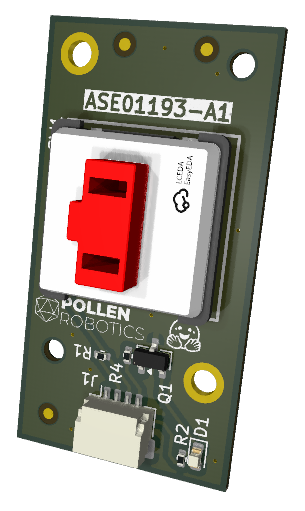
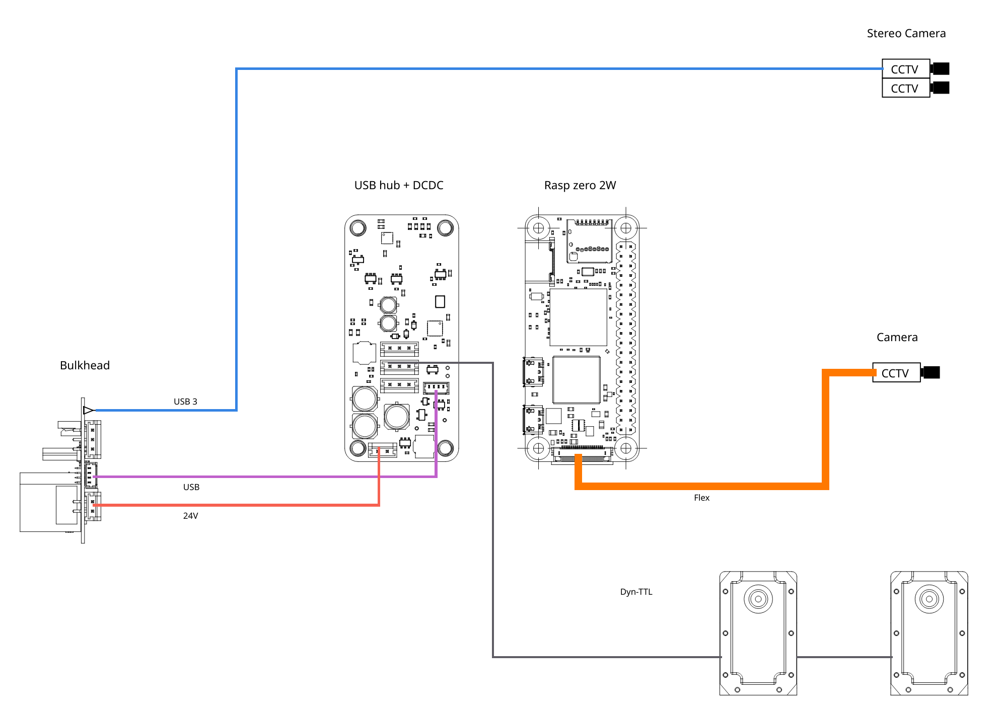
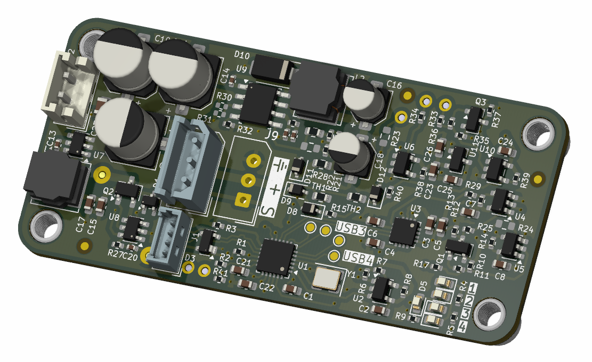
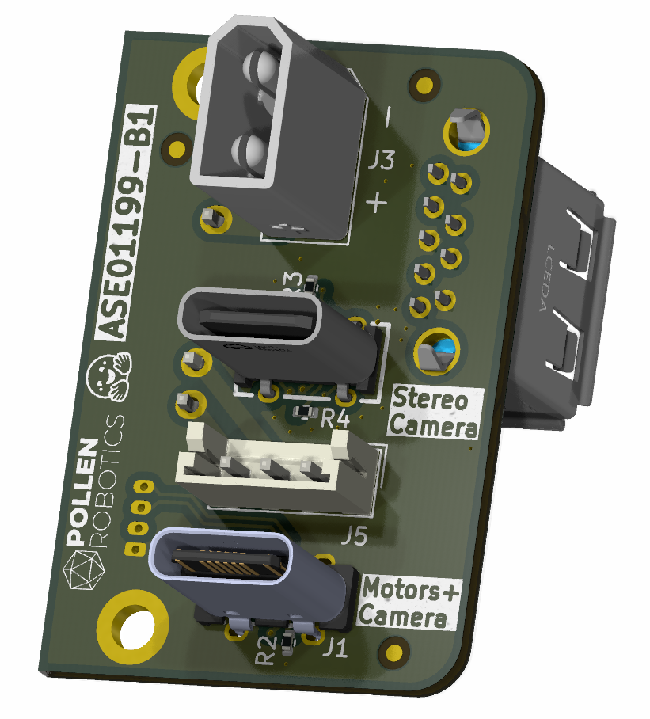

# "Grabette"/"Gripette" Electronic Boards

This repository is part of the "Grabette" project (https://github.com/pollen-robotics/grabette). It gathers several small PCBs of Grabette/Gripette. 

## Grabette
Grapette is the data acquisition side.

It is based on a battery-powered Raspberry PI 4 plus a HAT (github.com/pollen-robotics/elec_RPI_Robot_HAT) to which a serie of sensing elements is added. Camera, Stereo Camera, angle sensors, IMU (included on the HAT) and a button + a LED as user interface.

 - angle_sensor

 - IMU (Not used)

 - HMI

## Gripette
Gripette is the actuator side. 

It also gathers data with the same Camera/Stereo Camera system and drive motors. The "under-HAT" electronic board is associated to a Raspberry PI zero 2W. It has a interface to the motors (now Feetech wiring). A Bulk-head board makes the mechanical interface with the arm that holds Gripette.

Bulk-head:

## Basically
 - Designed with KiCAD 9.
